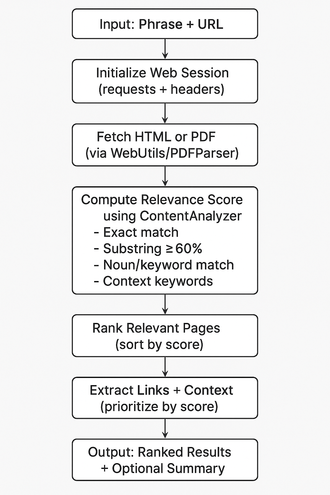

# 🌐 Web Extractor

**Web Extractor** is a general-purpose, phrase-based focused web crawler that retrieves web pages and PDFs relevant to any input phrase or sentence — on any topic, domain, or website.

📄 **[View the live showcase page](https://dheeraj7000.github.io/web-extractor/)**

It combines:

* Multi-level textual relevance scoring (exact, substring, noun, keyword)
* Intelligent, depth-limited crawling
* Context-aware link prioritization
* PDF parsing and text extraction.
* Ready placeholder for future **LLM-based summarization**

---
## Workflow



## 🧩 Project Structure

```
web-extractor/
├── __init__.py
├── config.py
├── models.py
├── web_utils.py
├── pdf_parser.py
├── content_analyzer.py
├── crawler.py
├── extractor.py     # Placeholder for LLM summarization (Ollama, LangChain, etc.)
└── main.py          # CLI entry point
```

---

## ⚙️ Installation

### 1. Clone the Repository

```bash
git clone https://github.com/yourusername/web-extractor.git
cd web-extractor
```

### 2. Create a Virtual Environment (recommended)

```bash
python3 -m venv venv
source venv/bin/activate
```

### 3. Install Dependencies

```bash
pip install -r requirements.txt
```

If you don’t have a `requirements.txt` yet, you can create it using:

```bash
pip install requests beautifulsoup4 pydantic pdfplumber pymupdf pypdf lxml html5lib
pip freeze > requirements.txt
```

---

## 🚀 How to Run

From the parent directory (one level above `web-extractor/`), run:

```bash
python -m web-extractor.main --phrase "quantum error correction" --url "https://quantumai.google" --max-pages 8 --depth 2 --summarize
```

### **Command-line Options**

| Option             | Description                                           | Default      |
| ------------------ | ----------------------------------------------------- | ------------ |
| `--phrase`         | Phrase or sentence to search for                      | *(required)* |
| `--url`            | Base website URL to start crawling from               | *(required)* |
| `--max-pages`      | Max number of relevant pages to return                | `10`         |
| `--depth`          | Maximum crawl depth                                   | `3`          |
| `--allow-external` | Allow following external links                        | `False`      |
| `--summarize`      | Produce a simple summary using placeholder LLM module | `False`      |

---

### 🧠 Example Runs

#### Example 1 – Search within a university site

```bash
python -m web-extractor.main --phrase "autonomous vehicle research" --url "https://mit.edu"
```

#### Example 2 – Allow external links and summarize

```bash
python -m web-extractor.main --phrase "AI safety policies" --url "https://openai.com" --allow-external --summarize
```

#### Example 3 – Crawl PDF-heavy domain

```bash
python -m web-extractor.main --phrase "renewable energy report" --url "https://energy.gov"
```

---

## 🧠 How It Works

1. **Initialization**

   * Creates a session with polite headers.
   * Starts from the base URL.
2. **Content Analysis**

   * Cleans and normalizes text.
   * Calculates relevance score based on:

     * Exact phrase matches
     * Long substring matches (≥60% of phrase)
     * Keyword and noun-based weights
3. **Link Prioritization**

   * Extracts `<a>` links and their context.
   * Prioritizes links based on local relevance and noun overlap.
4. **Recursive Crawling**

   * Expands into the most promising links (up to `depth` limit).
   * Avoids revisiting pages and respects domain boundaries.
5. **PDF Extraction**

   * Detects and downloads `.pdf` links.
   * Extracts text via **PyMuPDF**, **pdfplumber**, or **PyPDF** fallback.
6. **Summarization (Placeholder)**

   * Combines top pages into a focused summary block.
   * LLM integration (e.g., **Ollama**, **LangChain**) can be added later.

---

## 🧰 Example Output

Example (truncated JSON output):

```json
{
  "phrase": "quantum error correction",
  "base_url": "https://quantumai.google",
  "pages_scanned": 42,
  "relevant_pages_found": 7,
  "pages": [
    {
      "url": "https://quantumai.google/research/qec",
      "title": "Quantum Error Correction Research",
      "content": "...",
      "relevance_score": 78,
      "depth": 1
    }
  ],
  "summary": {
    "phrase": "quantum error correction",
    "page_count": 7,
    "focused_content": "--- PAGE: Quantum Error Correction Research\nURL: https://quantumai.google/research/qec\n..."
  }
}
```

---

## 🧪 Dependencies

| Package                          | Purpose                            |
| -------------------------------- | ---------------------------------- |
| `requests`                       | Web requests                       |
| `beautifulsoup4`                 | HTML parsing                       |
| `pydantic`                       | Data model validation              |
| `pdfplumber`, `pymupdf`, `pypdf` | PDF text extraction                |
| `lxml`, `html5lib`               | Optional parsers for BeautifulSoup |

---

## 🧭 Future Extensions

* ✅ Integrate **LLM-based summarization** (Ollama / LangChain / OpenAI)
* ✅ Add **semantic similarity scoring** for phrase paraphrases
* ✅ Include **async crawling** for large domains
* ✅ Build a **Streamlit dashboard** for live visualization

---

## 📄 License

MIT — use it, fork it, extend it - contributions welcome.
